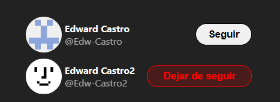

# Twitter Follow Component

componente de tarjeta de seguimiento inspirado en la funcionalidad de Twitter para seguir a un usuario. 

## Curso de React [2023]: De cero hasta crear tus primeros componentes con estado

Este proyecto está basado en el tutorial de [midulive] en su canal de YouTube. El tutorial original se puede encontrar [https://www.youtube.com/watch?v=7iobxzd_2wY&t=7396s].


## Vista Previa



### Instalación

Asegúrate de tener Node.js y npm instalados. Luego, sigue estos pasos:

```bash
# Clona el repositorio
git clone https://github.com/TuUsuario/Twitter-Follow-Component.git

# Entra al directorio del proyecto
cd Twitter-Follow-Component

# Instala las dependencias
npm install